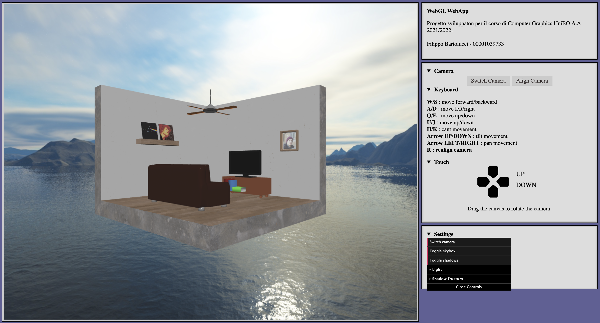
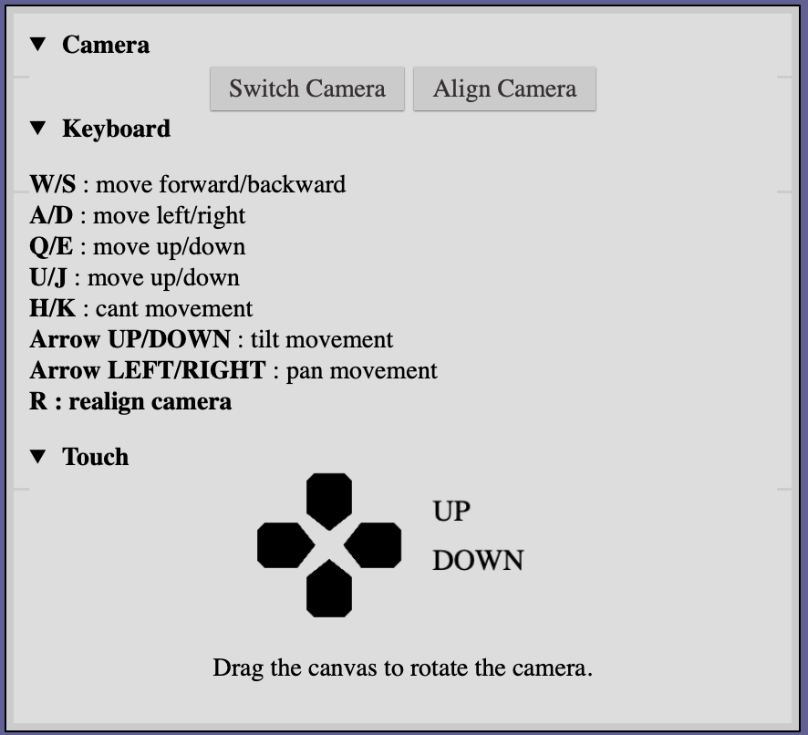

# Progetto 
Questo progetto è stato sviluppo come prova d'esame per il corso "Computer Graphics A.A. 2021/2022".
L'obbiettivo è sviluppare una "3D-WebApp" usando WebGL (HTML5, CSS e contesto webgl), linguaggio JavaScript e OpenGL ES SL.

Il progetto sviluppato consiste in un'applicazione web che permette di visualizzare alcune scene 3D composte da una serie di oggetti.
I file che lo compongono sono i seguenti:

* **scene.js:** contiene la classe principale che gestisce tutte le altre.
* **camera.js:** classe che si occupa di gestire la camera e i suoi movimenti nello spazio
* **animated_camera.js:** camera 3D che si muove in automatico lungo un arco di circonferenza
* **mesh_obj:** classe per la gestione delle mesh
* **main.js:** entry point del programma.
* **utils.js:** file che contiene funzioni di supporto.

## Interfaccia

L’interfaccia dell’applicazione di presenta in due elementi, il canvas per il disegno e una colonna con controlli e impostazioni.

Il menù per le impostazioni del progetto è stato realizzato utilizzando dat.GUI .

Il movimento nella scena può essere gestito attraverso una tastiera oppure tramite touch.

I tasti per controllare il movimento sono visibili espandendo il menù laterale, mentre il per il touch è stato inserito un canvas 2D con disegnati alcuni pulsanti che permettono di muoversi.

È anche possibile trascinare, con mouse o tocco, sul canvas per ruotare la camera nella varie direzioni.

[Torna all'indice](#indice)

----