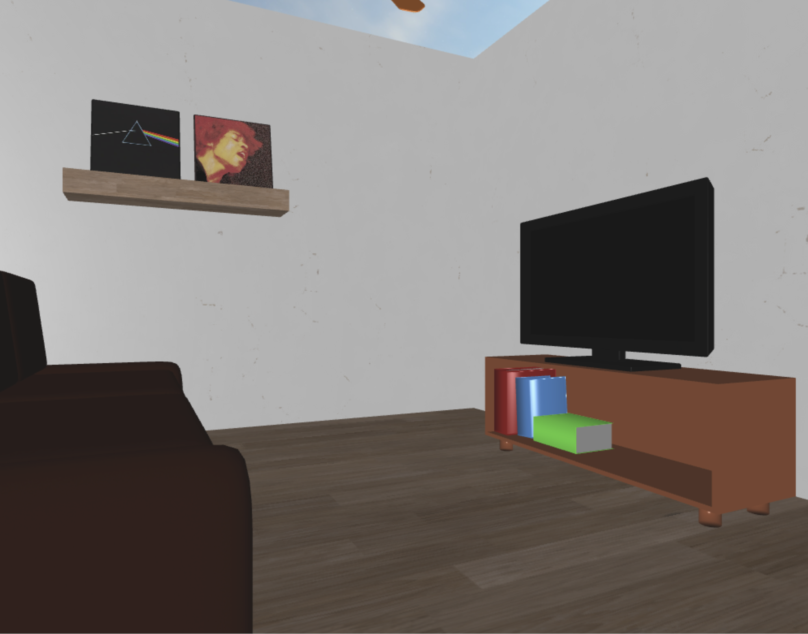

# scene.js
Rappresenta la classe principale che si occupa di tutte le operazioni, dalla inizializzazione del canvas e delle mesh al rendering.

Quando viene creato un nuovo oggetto scena vengono eseguite le seguenti operazioni:

* viene preso il WebGL rendering context dal canvas 
* impostazione delle dimensioni della viewport
* compilazione di vertex e fragment shader
* lettura di un **file json** per ottenere la lista delle mesh da mostrare.
* per ogni elemento mesh nel file json viene creato un nuovo **mesh_obj** e salvato in una lista interna all'oggetto scena.
* inizializzazione di **camera**, **keys** (struttura per la gestione dei tasti della tastiera) e **light** (oggetto luce di scena)

L'utilizzo di una classe che contiene tutte le principali variabili da utilizzare
mi ha permesso di ridurre e semplificare il codice da scrivere e poter usare le
stesse variabili da passare alle mesh, senza dover ricalcolare le stesse cose più volte.

Le mesh da visualizzare sono salvate in file json caricato all'avvio. Così facendo posso creare
scene diverse semplicemente creando più file json diversi.

Di seguito viene riportato un esempio di come è scritto un oggetto mesh in una scena:
```json
  "meshes":[
    {
      "name":"mesh_1",
      "obj_source":"./path/mesh.obj",
      "mtl_source":"./path/mesh",
      "position": [0, 0, 0]
    }
  ]
```

Per ogni mesh nella lista vengono scritte le seguenti proprietà:

* **name:** nome della mesh, usato solo per identificare le singole mesh e debug
* **obj_source:** path al file .obj
* **mtl_source:** path al file .mtl
* **position:** posizione della mesh iniziale della mesh. 

I valori in **position** vengono sommati alle coordinate della geometria dell'oggetto, traslandolo così nella posizione desiderata.


## Metodi

### async load_mesh_json(json_path)

Si occupa di leggere un file json contenente gli oggetti di scena; per ciascuno oggetto viene poi passato a un costruttore di mesh_obj e salvato poi in ```scene.mesh_list```.

### projectionMatrix()

Calcola la matrice di proiezione passando utilizzando la funzione perspective della libreria m4.js.

### key_controller(){

Funzione che legge gli input da tastiera e chiama le funzioni di movimento della camera a ogni tasto. La funzione è stata realizzata in modo tale da permettere di fare più movimenti in contemporanea. Viene richiamata ogni volta che deve essere disegnato un frame.

### switch_camera(){

Passa dalla camera libera a quella animata e viceversa.

### async prepareSkybox()

Funzione che si occupare di caricare la cubemap texture per lo skybox. Tutti i dati dello skybox sono salvati in ```scene.skybox```.

### toggle_skybox()

Attiva o disattiva lo skybox cambiando il valore di ```scene.skybox.enable```. Se impostato a falso, la fase di disegno dello skybox viene saltata.

### async prepareShadow()

Funzione che si occupa della preparazione dei dati per la gestione delle ombre.

* compilazione shaders corrispondenti
* creazione di una texture utilizzata come depth map
* impostazione dei valori utilizzati in fase di rendering.
 
### toggle_shadows()

Passa dal programma shader con ombre a quello senza e viceversa.

### draw()

Funzione separata dalla classe Scene per questioni di scope. Esegue le seguenti operazioni:

* ridimensiona canvas e viewport in base alla grandezza della finestra.
* chiama ```scene.key_controller()``` per la gestione degli input da tastiera.
* calcola la matrice di proiezione e vista.
* la matrice di vista viene ottenuta da ```scene.camera``` che può essere un oggetto ```Camera``` o ```Animated_Camera```.
* a seconda del valore di ```scene.shadow.enable```:
  * esegue il rendering della scena con ombre.
  * esegue il rendering della scena senza ombre.
* a seconda del valore di ```scene.skybox.enable``` disegna o meno lo skybox.

Per il render è stato attivato ``gl.BLEND`` quindi, se un materiale di un oggetto ha opacità minore di uno, questo verrà disegnato con una trasparenza.
  
### Rendering base

La scene disegnata con il rendering base ha queste caratteristiche:

* supporto per texture e colori
* luce diffusa
* specular lightning




### Rendering con ombre

La tecnica di rendering avanzato che ho scelto per il mio progetto sono le ombre, realizzate con tecnica di shadowmapping.

Per poter generare le ombre la scena viene disegnata due volta, prima dal punto di vista della luce per generare una shadowmap, poi dal punto di vista dell'osservatore utilizzando la shadowmap generata per capire se un punto è in ombra o meno.


[Torna all'indice](#indice)

----