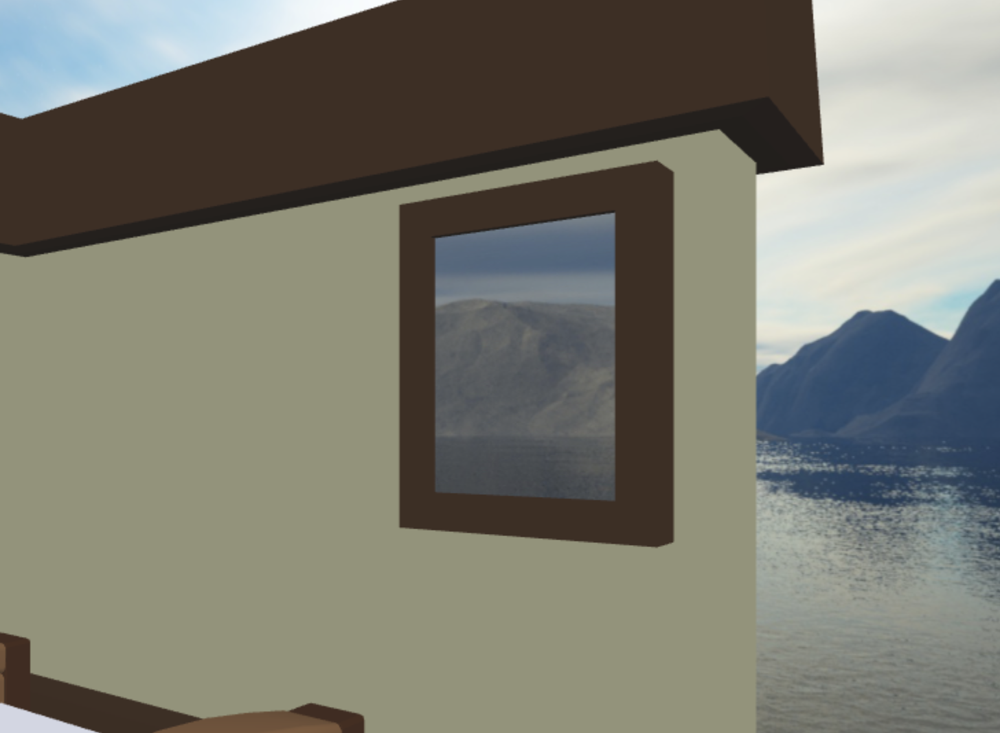

# mesh_obj.js
Questa classe si occupa di tutti le funzionalità delle mesh visibili in scena, dal loro caricamento al render.
Il costruttore prende un oggetto, ottenuto dalla lettura di un json in ```scene.js```, contenente tutte le impostazioni come:

* path per il file .obj
* path per il file .mtl
* posizione dell' oggetto rispetto all'origine

## Metodi

### prepare_mesh(gl)
Funzione chiamata dal costruttore dopo che viene letto il file obj. Si occupa della creazione dei buffer, utilizzando la funzione ```webglUtils.createBufferInfoFromArrays(gl, data)```, per le varie componenti della mesh.

### render(gl, programInfo, uniforms)
Funzione che disegna l'oggetto utilizzando il programma e le uniform specificate nei parametri. Viene chiamata dalla funzione render che si occupa di scegliere programInfo e uniform a seconda del tipo di rendering scelto.

## mirror.js
Un tipo speciale di oggetto è mirror che differisce dagli altri per avere una envmap come texture. Per usarlo bisognare settare ```mirror: " true ``` nel json della scena e poi dare un path per la envmap da usare (in ```scene2.json``` c'è un esempio di utilizzo).

````json
    {
      "name": "mirror",
      "mirror": true,
      "obj_source": "./data/mirror/mirror.obj",
      "env_path": "./data/scene2_env/",
      "position": [0, 0, 0]
    }
````




* [Torna all'indice](#indice)

---